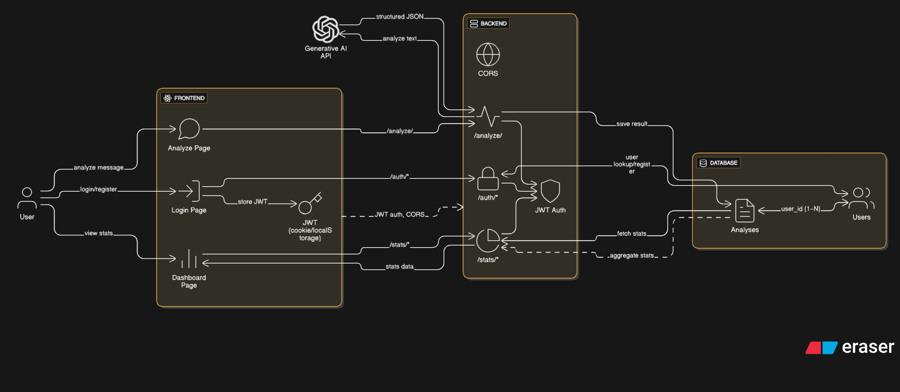

# ThreatIQ – AI-Powered Phishing Detection Chatbot

## Project Overview
ThreatIQ is a prototype application that uses generative AI to analyze messages and detect potential phishing attempts. The system provides real-time analysis, user-friendly dashboards, and clear security insights. It is designed as part of the EPITA Bachelor 4th semester project on *Generative AIs & Chatbots*. It will soon be upgraded to a helpful AI Agent.

The platform combines:
- A secure backend (FastAPI + Firebase Auth).
- A responsive frontend (Next.js + React + shadcn/ui + Recharts).
- Integration with a generative AI model for phishing detection and explanation.
- Dashboard analytics with visual insights.

---

## Project Architecture
The overall system design is illustrated below:

---

## Features

### Chatbot Analysis
- Users can paste any suspicious message (email, text, link).
- The AI model analyzes the content and returns:
  - **Judgment**: Safe, Phishing, or Other.
  - **Explanation**: Why the content is suspicious or safe.
  - **Tips**: Recommended user actions.
- User can chat with ThreatIQ AI Agent(built in), to get any type of information, suggestion, analyses or practice from AI Agent.

### Dashboard Analytics
- **Interactive Line Chart**: Daily analysis activity.
- **Horizontal Bar Chart**: Monthly breakdown of analyses.
- **Pie Chart**: Distribution of judgments (Safe vs. Phishing vs. Other).

### User Management
- Firebase authentication and authorization.
- Role-based access (User / Admin).
- Secure password storage.

### Backend Services
- Analysis endpoint to process text and return AI results.
- History endpoint for retrieving past analyses per user.
- Stats endpoints to provide aggregated insights for dashboard charts.
- Chat endpoit to talk with ThreatIQ AI Agent.
- Seeding script to generate realistic sample data.

### Frontend Experience
- Clean, responsive design with **shadcn/ui**.
- Sidebar navigation with theme toggle and user avatar.
- Real-time chatbot interface with message bubbles.
- Loading states such as “Analyzing your message...”, "loading...", "thinking...", etc for better UX.

### Security & Privacy
- Authentication with Firebase and cookie storage.
- Role management for future admin capabilities.
- Considerations for handling sensitive user data:
  - Storing only minimal analysis metadata.
  - Returning AI results without persisting personal input.

---

## Technologies Used

### Backend
- **FastAPI** – API framework   
- **MongoDB** – Database  
- **Firebase** – Authentication  
- **Uvicorn** – ASGI server  

### Frontend
- **Next.js (React)** – Framework  
- **shadcn/ui + TailwindCSS** – UI components  
- **Recharts** – Interactive charts   

### AI Integration
- Gemini AI API integration to classify and explain messages.
- JSON-structured responses for judgments, explanations, and tips.

---

## Deliverables Alignment
According to project requirements:
- **Innovation**: A focused phishing-detection chatbot with dashboards — niche but relevant in cybersecurity.  
- **Conception & Organization**: Implemented with modular architecture, backend/frontend separation, reusable components, and GitHub versioning.  
- **Realization & Technologies**: Fully functional backend (auth, analyze, history, stats, chat endpoints) and frontend (dashboard, analyze, history, settings, security chat with AI Agent).  
- **Generative AI**: Integrated AI model/API for phishing detection.  
- **Data Privacy**: Minimal data storage, strong authentication, role management.  
- **Security**: FIrebase auth, role enums, protected routes, and basic threat considerations.  
